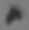
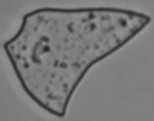
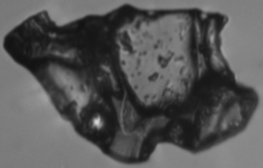
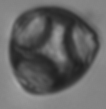
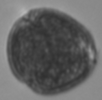
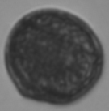
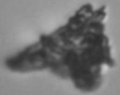

# ICELEARNING 
[](https://doi.org/10.5281/zenodo.7591282)


<p align="center">
  
</p>

Detection of ice core particles via deep neural networks. 

### Data

Download the ```datasets``` folder from Zenodo. This folder contains all the train and GRIP data. The GRIP data are placed in the ```datasets/test/``` folder.

For each training class, you find the ```particle.csv``` file and the corresponding image folder (see column _imgpaths_ in the csv file). 

The ```.csv``` files also contain the metadata of the particles. There is also a ```train.csv``` file which includes all ```particle.csv``` files merged together.

| Particle | Particle .csv file | N| Example figure|
| :---:  | :---: | :---: | :---: |
| Dust | ```datasets/dust.csv``` | 30758 |  |
| Felsic tephra  | ```datasets/camp.csv``` | 7625 |  |
| Basaltic tephra  | ```datasets/grim.csv``` | 6271 |  |
| Pollen C. _avellana_ | ```datasets/corylus.csv``` | 47723 |  |
| Pollen Q. _robur_ | ```datasets/qrob.csv``` | 35776 |  |
| Pollen Q. _suber_ | ```datasets/qsub.csv``` | 32245 |  |
| Contamination/Blurry | ```datasets/cont.csv``` | 11939 |  |

### Create training dataset 🏋️ & train the model 🤖

```
python model_train.py
```
This code will implement the following sequence:
* Creation of train/val/test datasets. The val dataset was used for hyperparameter tuning. Both the val and test datasets consist of a 500 image/class random subset.
* Model training and validation loops. The model performance is saved as ```model_training_performance.csv```
* The trained model is saved as ```saved_model/ICELEARNING_net.pth```
* The model is applied to the test dataset and the Confusion Matrix will be shown and saved as ```confusion_matrix_test_dataset.pdf```. The ```model_test_results.csv``` file contains the predictions on the test dataset, as well as the 64d-embeddings of the last FC layer of the resnet branch.
* If ```CFG.run_umap_test``` is set to ```True```, UMAP is run and will cluster the 64d-embeddings down to 2d. The UMAP clustering will be saved as ```umap_test.pdf```. 

Check and modify all parameters and filenames in the config file ```CFG.py```.


### Model inference on GRIP ice core samples 🕵🏿

```
python model_test.py
```
This code will implement the following sequence:
* The trained model ```saved_model/ICELEARNING_net.pth``` is loaded.
* The GRIP dataset is loaded (note: 3M+ images).
* Inference loop on each particle of the GRIP dataset.
* The ```test/inference_on_GRIP_samples.csv``` final dataset is saved. This dataset will contain the particles' metadata, the model probabilities and predictions. Another similar file is saved (```test/inference_on_GRIP_samples_no_metadata.csv```), which includes the 64d-embeddings of the resnet FC layern but does not include the particles' metadata.

## Citation
If you find this code helpful, please cite as below:
```
@article{maffezzoli2023,
  title={Detection of ice core particles via deep neural networks},
  author={Maffezzoli, N. and Cook, E. and van der Bilt, W. G. M. and St{\o}ren, E. N. and Festi, D. and Muthreich, F. and Seddon, A. W. R. and Burgay, F. and Baccolo, G. and Mygind, A. R. F. and Petersen, T. and Spolaor, A. and Vascon, S. and Pelillo, M. and Ferretti, P. and dos Reis, R. S. and Sim\~oes, J. C. and Ronen, Y. and Delmonte, B. and Viccaro, M. and Steffensen, J. P. and Dahl-Jensen, D. and Nisancioglu, K. H. and Barbante, C.},
  journal={The Cryosphere},
  volume={17},
  number={2},
  pages={539--565},
  year={2023},
  url = {https://tc.copernicus.org/articles/17/539/2023/},
  doi = {10.5194/tc-17-539-2023}
  publisher={Copernicus GmbH}
}
```

## References
1. Maffezzoli, N., Cook, E., van der Bilt, W. G. M., Støren, E. N., Festi, D., Muthreich, F., Seddon, A. W. R., Burgay, F., Baccolo, G., Mygind, A. R. F., Petersen, T., Spolaor, A., Vascon, S., Pelillo, M., Ferretti, P., dos Reis, R. S., Simões, J. C., Ronen, Y., Delmonte, B., Viccaro, M., Steffensen, J. P., Dahl-Jensen, D., Nisancioglu, K. H., and Barbante, C.: Detection of ice core particles via deep neural networks, The Cryosphere, 17, 539–565, https://doi.org/10.5194/tc-17-539-2023, 2023.

2. Please see the Discussion/Review process at https://tc.copernicus.org/articles/17/539/2023/tc-17-539-2023-discussion.html

## Acknowledgments

[](https://marie-sklodowska-curie-actions.ec.europa.eu/)

The ICELEARNING project is supported by the European Union’s Horizon 2020 Marie Skłodowska-Curie Actions (grant no. 845115).

## Contact
For questions, contact niccolo.maffezzoli@unive.it
